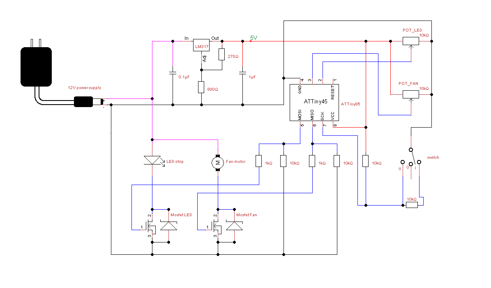

# Solder fume extractor

This project uses an ATTINY85 to control an LED and a PC fan (or 2) that are integrated in the rebuild of an old desk lamp.

## Logic specifications

The switch on the old desk lamp has 3 postitions:

- 0: Both LEDs and fans are off
- I: Only the LEDs are on and can be regulated by it's designated potentiometer
- II: Both the LEDs and fans are on and are regulated by each respective's potentiometer.

Because position 0 is actually in the middle position on the physical switch, a delay or fade needs to be added in case of switching from position I to II. This will prevent the LEDs from going off when switching the fans on or make it a lot less noticable.

In some cases during testing there was a chance of potentiometer fluctuations. In order to avoid using capacitors to smoothen the values, this will be added in software where a 2 or more potentiometer shift is required to update the output value.

Both the fans and leds don't switch on at all on the lower end of the PWM output value. Therefor the bottom of the output value needs to be increased to this 'deadzone' is greatly reduced or removed.

Because the fan needs more energy to get started than to continue running, run the fan at full power for the first few seconds when switched on, afterwards use it's potentiometer to regulate the output.

## Programming the ATTINY85

For the programming of the ATTINY85, a standard, official arduino UNO was used as ISP.

The following guide was used to be able to program the ATTINY85 via the Arduino uno:  
https://www.instructables.com/id/How-to-Program-an-Attiny85-From-an-Arduino-Uno/

Which I assume was based of this guide:  
http://highlowtech.org/?p=1695

**NOTE**: Depending on chip frequency set, there can be a tradeoff between LED flicker or PWM fan noise.
A 1 MHz clock will result in no of very little PWM fan noise but LED flicker may be noticable.
At an 8 or 16 MHz clock some PWM fan noise on the lower RPM's can be heard.
A capacitor over the output of the fan can also be placed to smoothen the output signal and reduce/eliminate the fan noise.
Howeven in my testing, this was not very consistent nor reliable.

## Schematics

